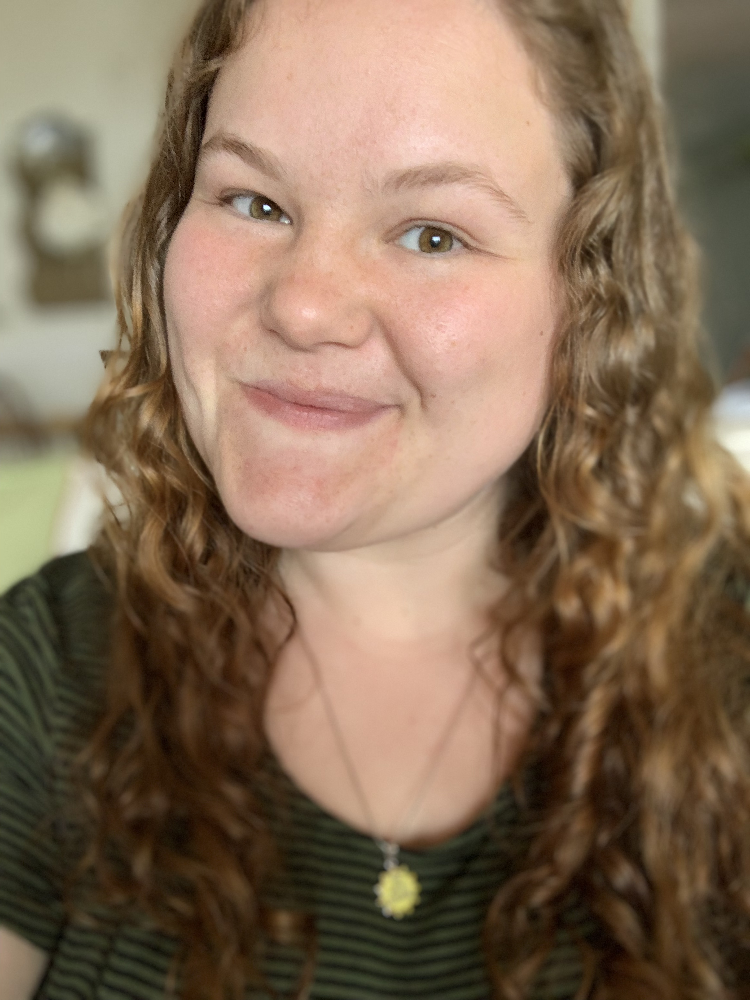

Megan Schmidt

:dancer:

Currently, my computer experience is very limited. I attended New Paltz as a math undergrad, and I took CS1 here with Professor Easwaran. In my Linear Algebra course, we did some work in Python, and I also took the Data Science course with Professor Brattain. In Data Science, we mainly used Python, but we touched briefly upon Tableau. In the required master’s Database course, I created a database project, but other than that, I do not have any projects that I’ve worked on. 

I see myself using the topics we learn in this course in my career. I’m not sure what I would like to do with my degrees once I graduate, so I’m taking every course as if I am getting a job in that field. I’m very excited to develop the apps, and I hope to use these when I attend interviews for future careers.
